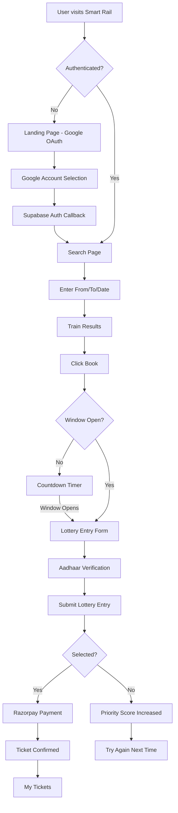
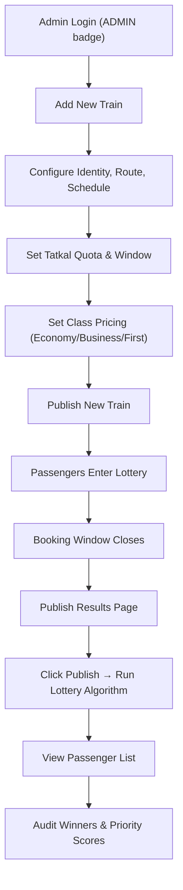

# Smart Rail — Lottery-Based Railway Booking System
## Complete Application Flow Report

---

# Section A: User Flow

The user flow covers the complete journey from authentication to ticket booking through the lottery-based system.

---

## Step 1: Landing Page (Sign In)

When an unauthenticated user visits the application, they see the Smart Rail landing page with a **"Continue with Google"** button.

**Key UI Elements:**
- Hero: "Book smarter journeys with a cleaner, faster rail experience."
- Feature badges: Live search flow, Lottery status tracking, Simple ticket management
- Google OAuth sign-in card

---

## Step 2: Google OAuth Authentication

Clicking "Continue with Google" redirects to Google's OAuth consent screen via Supabase.

**Key UI Elements:**
- Google account picker with available accounts
- Redirect via Supabase OAuth (`tqsiadlcbtpyrwjydgfs.supabase.co`)

---

## Step 3: Train Search Page

After login, the user lands on the **Search** page. The navbar shows the authenticated user's profile and role.

**Key UI Elements:**
- **From** and **To** station input fields
- **Date** picker (auto-filled with today's date)
- **"Search Trains →"** button
- Navbar: Search, My Tickets, profile avatar
- Admin users see additional: Add Train, Publish Results, Passengers

---

## Step 4: Train Results — List of Available Trains

After searching (e.g., Mumbai Central → New Delhi), matching trains are displayed with full details.

**Key UI Elements:**
- **Train card**: Name, Number, TATKAL badge
- **Schedule**: Departure/Arrival times, Duration
- **Fare classes**: Economy (₹1500), Business (₹2500), First Class (₹3500)
- **Seat availability** indicators (green dots)
- **"Book"** button to enter the lottery

---

## Step 5: Booking Window — Lottery Countdown

When clicking **"Book"**, the booking page shows a countdown timer if the lottery window hasn't opened yet.

**Key UI Elements:**
- **"Booking Window Opens Soon"** message with animated hourglass icon
- **Countdown timer** — Hours : Minutes : Seconds
- The lottery enforces a **5-minute submission window** to prevent bot advantages

---

## Step 6: Lottery Entry & Payment

Once the window opens, the user:
1. Selects preferred **travel class** (Economy / Business / First)
2. Enters **Aadhaar verification** (12-digit identity check)
3. Submits the **lottery entry**
4. If selected by the weighted algorithm → **Razorpay payment**
5. Upon payment → Ticket confirmed

> [!NOTE]
> The lottery uses a **weighted priority scoring algorithm** that rewards users with previous failures, ensuring fairness. Submission timing is tracked to detect bots.

---

## Step 7: My Tickets

Users view their bookings on the **My Tickets** page with booking count and status.

**Key UI Elements:**
- **"Ticket dashboard"** badge
- **BOOKINGS** counter (top right)
- Ticket list with status and payment confirmation
- "No tickets found yet" message when empty

---

---

# Section B: Admin Flow

Admin users (identified by `ADMIN_EMAIL` in the backend) have additional management pages visible in the navbar with an **ADMIN** badge.

---

## Step 8: Admin — Add New Train (Top Section)

Admins create new routes through the **"Add Train"** page. The form is organized into clear sections.

**Key UI Elements:**
- **Train Identity**: Train Number, Train Name
- **Route & Stations**: From Station, To Station
- **Schedule**: Departure/Arrival dates and times, Duration
- **Tatkal Quota**: Toggle for lottery booking + Opening/Closing windows

---

## Step 9: Admin — Add New Train (Pricing & Submit)

The bottom section of the Add Train form covers class configuration and submission.

**Key UI Elements:**
- **Class Configuration**: Economy, Business, First — Available Seats & Fare Per Seat (₹)
- **"Publish New Train"** button (full-width, prominent)
- **DEV PREVIEW** panel showing the JSON payload being sent

---

## Step 10: Admin — Publish Lottery Results

The **Publish Results** page lists all trains with their schedules and a **"Publish"** button to run the lottery algorithm.

**Key UI Elements:**
- List of all trains with TATKAL badge
- Train details: Name, Number, Schedule, Route
- **"Publish"** button per train to trigger the lottery selection
- Trains shown: Mumbai Rajdhani 12951, Mumbai Rajdhani 12952, Shatabdi Express 12027

---

## Step 11: Admin — Passenger List

The **Passengers** page lets admins view selected passengers for any published lottery journey.

**Key UI Elements:**
- **"Passenger List"** header with ADMIN badge
- **Filter by Date** picker
- **Select Journey** dropdown for published journeys
- Filtered passenger list with booking status and priority scores

---

---

# System Architecture

---

# Admin Workflow

---

# Technology Stack

| Layer | Technology |
|-------|-----------|
| **Frontend** | Next.js 15 (App Router) |
| **Backend** | FastAPI (Python) |
| **Database** | SQLite (SQLModel ORM) |
| **Authentication** | Supabase + Google OAuth |
| **Payment** | Razorpay Integration |
| **Anti-Bot** | Aadhaar verification, Timing analysis, Priority scoring |

---

# Attached Documents

- [Fair Tatkal Report](file:///Users/doni/Downloads/FairTatkalReport.pdf)
